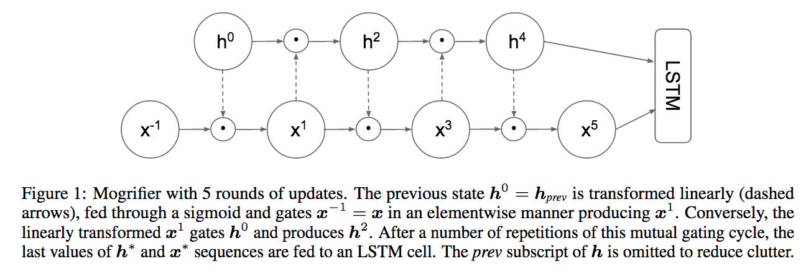

</img>

## Mogrifier

A complete implementation of <a href="https://openreview.net/forum?id=SJe5P6EYvS">Mogrifier</a>, a circuit for enhancing LSTMs and potentially other networks. It modulates two vectors by having each gate the other in an interleaved fashion.

## Install

```bash
$ pip install mogrifier
```

## Usage

```python
import torch
from mogrifier.mogrifier import Mogrifier

m = Mogrifier(
    dim = 512,
    iters = 5,   # number of iterations, defaults to 5 as paper recommended for LSTM
    k = 16       # factorize weight matrices into (dim x k) and (k x dim)
)

x = torch.randn(1, 16, 512)
h = torch.randn(1, 16, 512)

x_out, h_out = m(x, h) # (1, 16, 512), (1, 16, 512)
```

## Citation

```bibtex
@inproceedings{Melis2020Mogrifier,
    title={Mogrifier LSTM},
    author={Gábor Melis and Tomáš Kočiský and Phil Blunsom},
    booktitle={International Conference on Learning Representations},
    year={2020},
    url={https://openreview.net/forum?id=SJe5P6EYvS}
}
```
